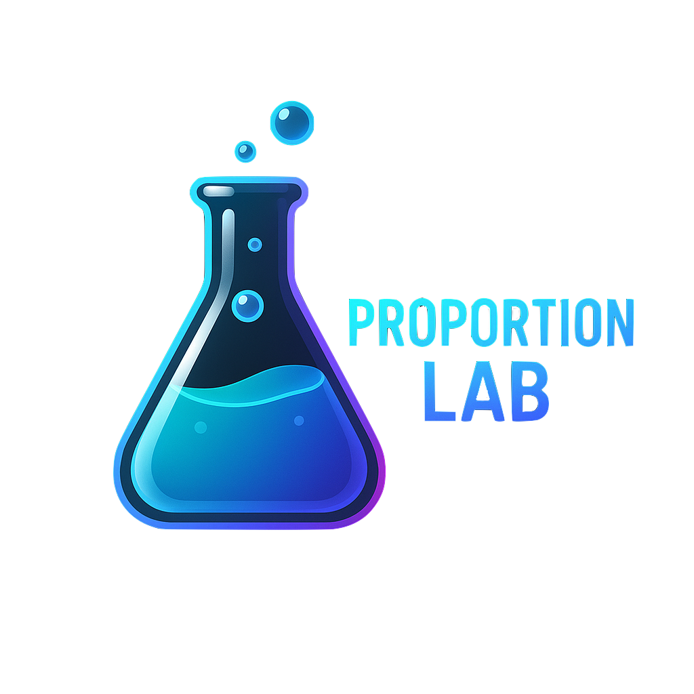
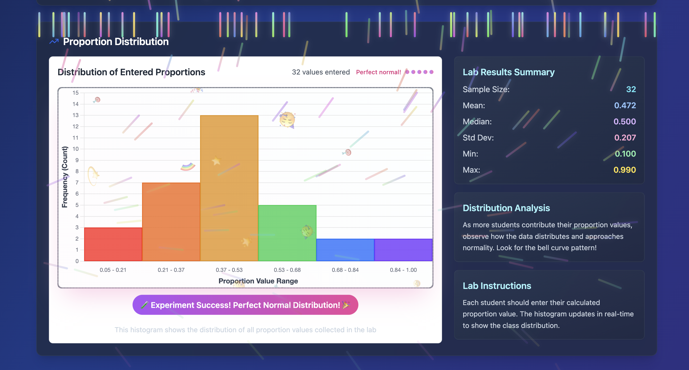

# Proportion Lab

<div align="center">
  

  <p>A beautiful, interactive laboratory for exploring proportion distributions in real-time. Perfect for AP Statistics education, science fair projects, or understanding the Central Limit Theorem.</p>
</div>

## 🎯 Live Demo


## 🚀 一键启动 (One-Click Start)

**完全自动化启动，无需任何前置环境！**

```bash
./start.sh
```

这个智能脚本会自动：
- 🔍 检测您的操作系统 (macOS/Linux)
- 📦 安装必要的开发环境 (Homebrew, Node.js, npm)
- ⚡ 配置项目依赖
- 🚀 启动开发服务器
- 🌐 在浏览器中打开应用

> 📖 详细说明请查看 [快速启动指南](./QUICKSTART.md)

## ✨ Features

### 🎛 Core Functionality
- **Interactive Data Collection**: Click to input proportion values with real-time validation
- **Real-Time Visualization**: Watch the distribution build up as you collect more data
- **Professional UI**: Modern, glass-morphism design with smooth animations
- **Responsive Design**: Works beautifully on all screen sizes

### 💾 Data Management (NEW!)
- **Auto-Save**: Current session data automatically saved to browser local storage
- **Session Management**: Save multiple independent data collection sessions
- **Historical Records**: View statistical summaries of all saved sessions
- **Session Recovery**: Automatically recover unsaved data after page refresh

### 📊 Excel Export Capabilities (NEW!)
- **Export Current Data**: Download Excel files with raw data and statistical summaries
- **Export All Sessions**: Each session as a separate worksheet with overall summary
- **Export Statistical Summary**: Comparison table of all sessions for research analysis

### 📥 Data Import Features (NEW!)
- **Flexible Formats**: Support comma-separated, line-separated, or percentage formats
- **Smart Parsing**: Automatically handle spaces, tabs, and various delimiters
- **Data Validation**: Automatically filter invalid values (outside 0-1 range)

### 📈 Statistical Insights
- Compare observed vs. theoretical statistics
- Real-time calculation of mean, median, standard deviation
- Visual distribution analysis with normality indicators
- Celebration effects for normal-looking distributions

## 🎯 Educational Value

This tool demonstrates key statistical concepts:
- **Central Limit Theorem**: How sample proportions approach normal distribution
- **Sampling Variability**: Why individual samples vary from population parameters
- **Statistical Inference**: Understanding the relationship between samples and populations
- **Data Management**: Real-world data collection and analysis workflows

## 🛠 Multiple Start Options

### Option 1: One-Click Start (Recommended)
```bash
./start.sh                 # Auto-configure and start
./start.sh --help          # View help information
./start.sh --check         # Check environment only
./start.sh --update        # Force update dependencies
```

### Option 2: Manual Start (Advanced Users)
```bash
npm install    # Install dependencies
npm run dev    # Start development server
```

### Option 3: Production Build
```bash
npm run build
npm run preview
```

## 🌍 System Support

- **macOS**: Fully automated with Homebrew integration
- **Linux**: Support for Ubuntu/Debian/CentOS/Fedora
- **Windows**: Manual setup required (use WSL recommended)

## 🎮 How to Use

1. **Start the Application**: Use `./start.sh` for automated setup
2. **Enter Data**: Input proportion values (0-1 or percentage format)
3. **Watch Distribution**: See the histogram update in real-time
4. **Save Sessions**: Click "Save Current Data" to preserve your work
5. **Export Results**: Download Excel files for further analysis
6. **Import Data**: Bulk import data from other sources

## 📊 Excel Export Examples

### Current Data Export
- **Raw Data Sheet**: Index, proportion value, timestamp
- **Statistics Sheet**: Count, mean, median, std dev, min, max, range

### All Sessions Export
- **Individual Session Sheets**: Each saved session as separate worksheet
- **Overall Summary**: Combined statistics across all sessions

### Summary Export
- **Session Comparison**: Side-by-side statistics for research analysis

## 🔧 Technical Stack

- **Vue 3**: Composition API with reactive data binding
- **Vite**: Fast build tool and development server
- **Chart.js**: Professional charting for data visualization
- **Tailwind CSS**: Utility-first styling with custom design system
- **XLSX**: Excel file generation and export
- **File-saver**: Client-side file download
- **Lucide Icons**: Beautiful, consistent iconography

## 📱 Browser Support

- Chrome (recommended)
- Firefox
- Safari
- Edge

## 🔒 Data Privacy

- **Local Storage**: All data saved in browser, never uploaded to servers
- **Privacy Protection**: Your experimental data is completely private
- **Data Backup**: Regular export recommended for important data
- **Cross-Device**: Data doesn't sync between devices (browser-local storage)

## 🧪 Scientific Applications

### Perfect for:
- **Science Fair Projects**: Collect participant proportion estimation data
- **Statistics Education**: Demonstrate Central Limit Theorem visually
- **Psychology Experiments**: Study human proportion perception abilities
- **Research Studies**: Collect and analyze quantitative feedback
- **Data Science Courses**: Real-time data collection and visualization

### Research Recommendations:
1. **Experimental Design**: Plan data collection strategy beforehand
2. **Session Grouping**: Create different sessions for different experimental conditions
3. **Data Backup**: Export important experimental data regularly
4. **Result Analysis**: Use Excel for further statistical analysis

## 🎨 Design Philosophy

- **Minimalist**: Clean, uncluttered interface focusing on the data
- **Professional**: Suitable for academic presentations and classroom use
- **Accessible**: High contrast colors and clear typography
- **Engaging**: Smooth animations and interactive feedback

## 📚 Documentation

- **[Quick Start Guide](./QUICKSTART.md)**: Get up and running in minutes
- **[Feature Documentation](./FEATURES.md)**: Detailed feature explanations
- **[Technical Details](./README.md)**: This comprehensive guide

## 🤝 Contributing

This project is designed for educational use. Feel free to:
- Report issues or bugs
- Suggest new features
- Submit improvements
- Use in your own educational materials

## 📄 License

MIT License - free for educational and commercial use.

---

**Perfect for**: Statistics courses, science fair projects, data science education, and anyone wanting to understand sampling distributions visually! 

**🎉 Now with comprehensive data management - making it a complete data collection and analysis platform!** 
